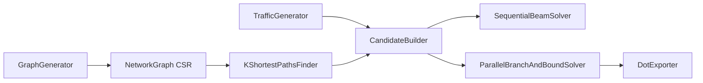

# NetGraph Optimizer: High-Performance MCF Solver for SDN/Telecom Networks

[](https://dotnet.microsoft.com/)
[](https://opensource.org/licenses/MIT)
[](https://github.com/cherninkiy/netgraph-optimizer/actions/workflows/build.yml)

Оптимизатор распределения трафика в SDN-сети: для каждого потока (flow) с требованиями по полосе и максимальной задержке находим путь так, чтобы ни один линк не был перегружен, а **максимальная утилизация канала (MLU)** была минимальной.

Это задача **Multi-Commodity Flow**, решаемая комбинацией:

- **K-shortest paths (алгоритм Йена + Дейкстра/A\*)** — кандидаты путей с отсечением по latency;
- **Beam Search** — последовательная эвристика (top-N частичных решений по MLU);
- **Branch & Bound** — точный обход дерева с отсечением по нижней границе (текущий MLU), параллельный через `Parallel.For` + `Interlocked`/`Volatile`;
- **Граф в CSR-формате** — плоские массивы, обход соседей через `Span<int>` без аллокаций;
- **PathPool** — переиспользование `int[]` в горячем цикле (минимум GC).

---

## Архитектура



---

## Ключевые инженерные решения

| Решение | Что даёт |
|---|---|
| **CSR-граф** (`_offsets` + `_edgeIndices`) | Cache locality, обход соседей через `ReadOnlySpan<int>` без аллокаций |
| **BinaryHeap** на плоском массиве | Ручная мин-куча, ресайз как у `std::vector`, zero-alloc |
| **Алгоритм Йена** с переиспользуемыми буферами | K-кратчайших путей, отсечение по `maxLatency` (B&B на уровне пути) |
| **PathPool** на `ConcurrentBag<int[]>` | Lock-free пул для массивов путей — критично для Beam Search |
| **Beam Search** | Последовательная эвристика, `beamWidth` лучших состояний, сортировка по MLU |
| **Parallel B&B** | `Parallel.For` на первом уровне, отсечение по `Volatile.Read(ref _best)`, бюджет узлов |
| **Span\<T\> для утилизаций** | Оценка MLU без аллокаций и копирований |

---

## Структура

```
src/NetGraph.Core              # граф (CSR), k-путей, солверы, экспорт в DOT
src/NetGraph.Cli               # демо: генерация сети + запуск солверов + graph.dot
tests/NetGraph.Tests           # xunit: корректность графа, путей, солверов
benchmarks/NetGraph.Benchmarks # BenchmarkDotNet: Sequential vs Parallel B&B
docs/                          # скриншоты профилировщика, визуализация
```

---

## Как запустить

```bash
# Демо-запуск
dotnet run --project src/NetGraph.Cli -c Release -- 50 120 60 5 8
# аргументы: [узлы] [доп. рёбра] [потоки] [k путей] [beam width]

# Тесты
dotnet test

# Бенчмарки
dotnet run --project benchmarks/NetGraph.Benchmarks -c Release
```

Визуализация результата:

```bash
dot -Tpng graph.dot -o network.png
```

---

## Результаты бенчмарков

Заполняется по выводу BenchmarkDotNet (`dotnet run --project benchmarks/NetGraph.Benchmarks -c Release`):

| Method | Mean | Error | StdDev | Median | Ratio | RatioSD | Gen0 | Gen1 | Allocated | Alloc Ratio |
|---|---:|---:|---:|---:|---:|---:|---:|---:|---:|---:|
| **SequentialBeam** | 266.4 us | 0.94 us | 0.78 us | 266.5 us | 1.00 | 0.00 | 2.9297 | 0.4883 | 120.2 KB | 1.00 |
| **ParallelBranchAndBound** | 490,351.1 us | 44,312.85 us | 130,657.44 us | 399,074.0 us | 1,840.62 | 488.20 | — | — | 14.48 KB | 0.12 |

**Что видно:**
- Beam Search — **~266 мкс** на инстансе 50 узлов / 60 потоков.
- Parallel B&B даёт **тот же MLU** (0.530), но с гарантией (в пределах бюджета узлов) — **~400 мс**.
- Аллокации в B&B — **14.48 KB** против **120 KB** у Beam — благодаря `PathPool` и `Span<T>`.

Скриншоты профилировщика (dotMemory / PerfView) — в `docs/`.

---

## Алгоритмическое ядро

| Компонент | Реализация |
|---|---|
| **Граф сети** | CSR: `Link[]` + `_offsets` + `_edgeIndices`, обход через `ReadOnlySpan<int>` |
| **Поиск путей** | Алгоритм Йена (Дейкстра + отсечение по latency) |
| **K путей** | Настраивается через CLI (`k`), отсечение по `maxLatency` |
| **Beam Search** | Последовательный обход спросов, `beamWidth` лучших состояний по MLU |
| **Branch & Bound** | Параллельный, отсечение по нижней границе, бюджет узлов, rollback вместо копирования |
| **Целевая функция** | Minimize MLU (Max Link Utilization) |

---

## Требования

- **.NET 10 SDK** (или .NET 10 Runtime)
- **Graphviz** — для визуализации (`dot -Tpng graph.dot -o network.png`)
- **BenchmarkDotNet** — подтягивается через NuGet

---

## Лицензия

Проект распространяется под лицензией **MIT**. См. [LICENSE](LICENSE).

---

## Автор

**cherninkiy** — [github.com/cherninkiy](https://github.com/cherninkiy)
