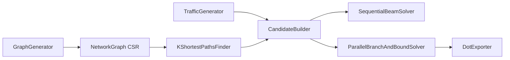

# High-Performance Traffic Optimizer for Telecom Networks

Оптимизатор распределения трафика в SDN-сети: для каждого потока (flow) с требованиями
по полосе и максимальной задержке находим путь так, чтобы ни один линк не был перегружен,
а **максимальная утилизация канала (MLU)** была минимальной.

Это задача **Multi-Commodity Flow**, решаемая комбинацией:

- **K-shortest paths (алгоритм Йена + Дейкстра/A\*)** — кандидаты путей с отсечением по latency;
- **Beam Search** — последовательная эвристика (top-N частичных решений по MLU);
- **Branch & Bound** — точный обход дерева с отсечением по нижней границе (текущий MLU),
  параллельный через `Parallel.For` + `Interlocked`/`Volatile`;
- **Граф в CSR-формате** — плоские массивы, обход соседей через `Span<int>` без аллокаций;
- **PathPool** — переиспользование `int[]` в горячем цикле (минимум GC).

## Архитектура



## Структура

```
src/NetGraph.Core          # граф (CSR), k-путей, солверы, экспорт в DOT
src/NetGraph.Cli           # демо: генерация сети + запуск солверов + graph.dot
tests/NetGraph.Tests       # xunit: корректность графа, путей, солверов
benchmarks/NetGraph.Benchmarks  # BenchmarkDotNet: Sequential vs Parallel B&B
```

## Как запустить

```bash
dotnet run --project src/NetGraph.Cli -c Release -- 50 120 60 5 8
# аргументы: [узлы] [доп. рёбра] [потоки] [k путей] [beam width]
dotnet test
dotnet run --project benchmarks/NetGraph.Benchmarks -c Release
```

Визуализация результата:

```bash
dot -Tpng graph.dot -o network.png
```

## Результаты бенчмарков

Заполняется по выводу BenchmarkDotNet (`dotnet run --project benchmarks/NetGraph.Benchmarks -c Release`):

| Solver | Время (ms) | MLU | Аллокации (MB) |
|--------|-----------:|----:|---------------:|
| Sequential Beam | — | — | — |
| Parallel B&B | — | — | — |

Скриншоты профилировщика (dotMemory / PerfView) — в `docs/`.
